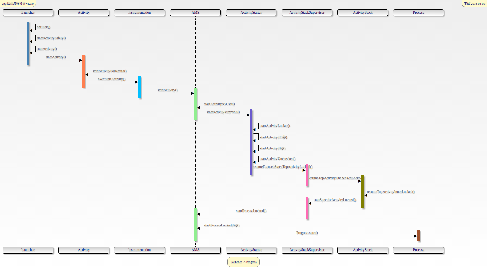
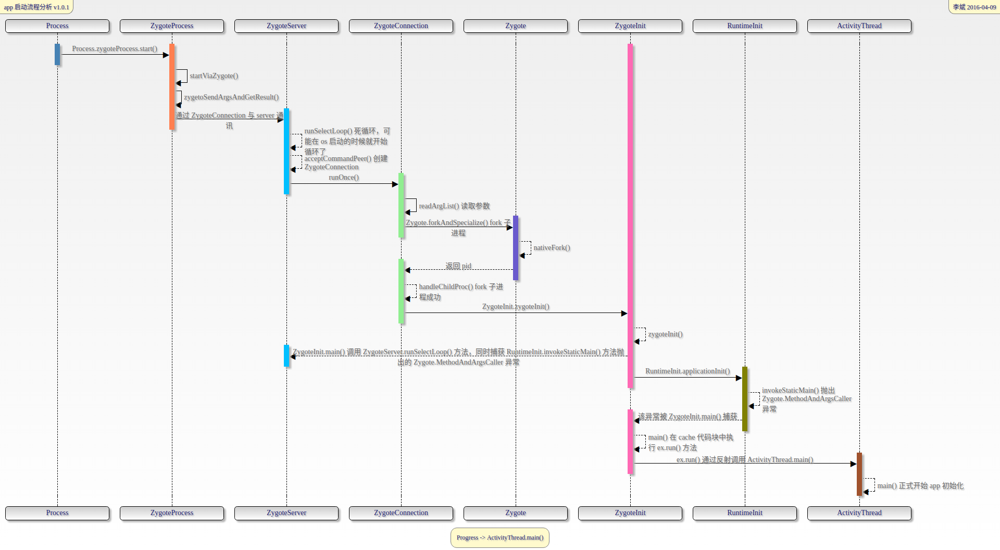

# App 启动流程源码分析(一)
> 第一阶段：从点击桌面 app 图标到 ActivityThread 的 main() 方法执行

## 先来两张图



## Launcher 
`/packages/apps/Launcher2/src/com/android/launcher2/Launcher.java`
- 什么是 Launcher 
  - 通俗来讲，Launcher 就是我们常说的桌面，屏幕解锁后看到的界面就是 Launcher。
  - 从代码层面来看 Launcher 本质上就是一个 Activity 并且实现了 View.onClickLister 接口，那就好说了，我们直接找到 onClick() 的具体实现。
    ```java
    public final class Launcher extends Activity implements View.OnClickListener, 
        OnLongClickListener, LauncherModel.Callbacks, View.OnTouchListener {    
        // ... 省略
    }
    ```
- #onClick()
```java
@Override
public void onClick(View v) {
    Object tag = v.getTag();
    if (tag instanceof Short``````cutInfo) {
        // ShortcutInfo: 表示工作空间和文件夹中的可启动图标, 可以理解为我们的 app 启动图标
        // Open shortcut
        final Intent intent = ((ShortcutInfo) tag).intent;
        int[] pos = new int[2];
        v.getLocationOnScreen(pos);
        intent.setSourceBounds(new Rect(pos[0], pos[1],
                pos[0] + v.getWidth(), pos[1] + v.getHeight()));
        // 跳转到 Launcher#startActivitySafely()
        boolean success = startActivitySafely(v, intent, tag);
        // ...
    } else if (tag instanceof FolderInfo) {
        // ...
    } else if (v == mAllAppsButton) {
        // ...
    }
}
```
- #startActivitySafely()
  ```java
  boolean startActivitySafely(View v, Intent intent, Object tag) {
      boolean success = false;
      try {
          // 跳转到 Launcher#startActivity();
          success = startActivity(v, intent, tag);
      } catch (ActivityNotFoundException e) {
          // ...
      }
      return success;
  }
  ```
- #startActivity()
```java
boolean startActivity(View v, Intent intent, Object tag) {
    intent.addFlags(Intent.FLAG_ACTIVITY_NEW_TASK);
    try {
        // Only launch using the new animation if the shortcut has not opted out (this is a
        // private contract between launcher and may be ignored in the future).
        boolean useLaunchAnimation = (v != null) &&
                !intent.hasExtra(INTENT_EXTRA_IGNORE_LAUNCH_ANIMATION);
        UserHandle user = (UserHandle) intent.getParcelableExtra(ApplicationInfo.EXTRA_PROFILE);
        LauncherApps launcherApps = (LauncherApps)
                this.getSystemService(Context.LAUNCHER_APPS_SERVICE);
        // 这里如果我们的 app 是从完全被杀死的状态唤起，会调用 startActivity() 方法，
        // 即 Activity#startActivity() 方法
        if (useLaunchAnimation) {
            ActivityOptions opts = ActivityOptions.makeScaleUpAnimation(v, 0, 0,
                    v.getMeasuredWidth(), v.getMeasuredHeight());
            // 这时候 user 还没被创建出来，UserHandle 与 pid 相关
            if (user == null || user.equals(android.os.Process.myUserHandle())) {
                // Could be launching some bookkeeping activity
                startActivity(intent, opts.toBundle());
            } else {
                // ...
            }
        } else {
            if (user == null || user.equals(android.os.Process.myUserHandle())) {
                startActivity(intent);
            } else {
                // ...
            }
        }
        return true;
    } catch (SecurityException e) {
        // ...
    }
    return false;
}
```

## Activity
`/frameworks/base/core/java/android/app/Activity.java`
- #startActivity()
- #startActivityForResult(Intent intent, int requestCode, Bundle options);
```java
public void startActivityForResult(@RequiresPermission Intent intent, int requestCode, @Nullable Bundle options) {
    // 当 Activity 被创建的时候 mParent 才会被赋值，后面会看到
    if (mParent == null) {
        options = transferSpringboardActivityOptions(options);
        Instrumentation.ActivityResult ar =
            mInstrumentation.execStartActivity(
                this, mMainThread.getApplicationThread(), mToken, this,
                intent, requestCode, options);
        // ...
    } else {
        // ...
    }
}
```

## Instrumentation 
`/frameworks/base/core/java/android/app/Instrumentation.java`
- #execStartActivity()
```java
public ActivityResult execStartActivity(
        Context who, IBinder contextThread, IBinder token, Activity target,
        Intent intent, int requestCode, Bundle options) {
    IApplicationThread whoThread = (IApplicationThread) contextThread;
    Uri referrer = target != null ? target.onProvideReferrer() : null;
    if (referrer != null) {
        intent.putExtra(Intent.EXTRA_REFERRER, referrer);
    }
    // mActivityMonitors 的作用是记录新生成的 Activity ，目前不会走到这里，
    // 下面的 for 循环直接略过
    if (mActivityMonitors != null) {
        synchronized (mSync) {
            // ...
        }
    }
    try {
        intent.migrateExtraStreamToClipData();
        intent.prepareToLeaveProcess(who);
        // 这里调用了 AMS(ActivityManagerService) 的 startActivity() 方法
        int result = ActivityManager.getService()
            .startActivity(whoThread, who.getBasePackageName(), intent,
                    intent.resolveTypeIfNeeded(who.getContentResolver()),
                    token, target != null ? target.mEmbeddedID : null,
                    requestCode, 0, null, options);
        checkStartActivityResult(result, intent);
    } catch (RemoteException e) {
        throw new RuntimeException("Failure from system", e);
    }
    return null;
}
```

## ActivityManagerService 
`/frameworks/base/services/core/java/com/android/server/am/ActivityManagerService.java`
- #startActivity() -> startActivityAsUser()
```java
@Override
public final int startActivityAsUser(IApplicationThread caller, String callingPackage,
        Intent intent, String resolvedType, IBinder resultTo, String resultWho, int requestCode,
        int startFlags, ProfilerInfo profilerInfo, Bundle bOptions, int userId) {
    enforceNotIsolatedCaller("startActivity");
    userId = mUserController.handleIncomingUser(Binder.getCallingPid(), Binder.getCallingUid(),
            userId, false, ALLOW_FULL_ONLY, "startActivity", null);
    // TODO: Switch to user app stacks here.
    // 调用 ActivityStarter#startActivityMayWait() 方法
    return mActivityStarter.startActivityMayWait(caller, -1, callingPackage, intent,
            resolvedType, null, null, resultTo, resultWho, requestCode, startFlags,
            profilerInfo, null, null, bOptions, false, userId, null, null,
            "startActivityAsUser");
}
```

## ActivityStarter
`/frameworks/base/services/core/java/com/android/server/am/ActivityStarter.java`
- #startActivityMayWait()
```java
final int startActivityMayWait(IApplicationThread caller, int callingUid,
        String callingPackage, Intent intent, String resolvedType,
        IVoiceInteractionSession voiceSession, IVoiceInteractor voiceInteractor,
        IBinder resultTo, String resultWho, int requestCode, int startFlags,
        ProfilerInfo profilerInfo, WaitResult outResult,
        Configuration globalConfig, Bundle bOptions, boolean ignoreTargetSecurity, int userId,
        IActivityContainer iContainer, TaskRecord inTask, String reason) {
    // ...
    // 收集 ResolveInfo
    ResolveInfo rInfo = mSupervisor.resolveIntent(intent, resolvedType, userId);
    // ...
    // Collect information about the target of the Intent. 收集 ActivityInfo
    ActivityInfo aInfo = mSupervisor.resolveActivity(intent, rInfo, startFlags, profilerInfo);

    ActivityOptions options = ActivityOptions.fromBundle(bOptions);
    ActivityStackSupervisor.ActivityContainer container =
            (ActivityStackSupervisor.ActivityContainer)iContainer;
    // 收集 callingUid 和 callingPid
    synchronized (mService) {
        if (container != null && container.mParentActivity != null &&
                container.mParentActivity.state != RESUMED) {
            // Cannot start a child activity if the parent is not resumed.
            return ActivityManager.START_CANCELED;
        }
        final int realCallingPid = Binder.getCallingPid();
        final int realCallingUid = Binder.getCallingUid();
        int callingPid;
        if (callingUid >= 0) {
            callingPid = -1;
        } else if (caller == null) {
            callingPid = realCallingPid;
            callingUid = realCallingUid;
        } else {
            callingPid = callingUid = -1;
        }

        final ActivityStack stack;
        if (container == null || container.mStack.isOnHomeDisplay()) {
            stack = mSupervisor.mFocusedStack;
        } else {
            stack = container.mStack;
        }
        stack.mConfigWillChange = globalConfig != null
                && mService.getGlobalConfiguration().diff(globalConfig) != 0;
        // ...
        final ActivityRecord[] outRecord = new ActivityRecord[1];
        // 调用 startActivityLocked() 方法
        int res = startActivityLocked(caller, intent, ephemeralIntent, resolvedType,
                aInfo, rInfo, voiceSession, voiceInteractor,
                resultTo, resultWho, requestCode, callingPid,
                callingUid, callingPackage, realCallingPid, realCallingUid, startFlags,
                options, ignoreTargetSecurity, componentSpecified, outRecord, container,
                inTask, reason);
        Binder.restoreCallingIdentity(origId);
        // ...
        return res;
    }
}
```
- #startActivityLocked()
```java
int startActivityLocked(IApplicationThread caller, Intent intent, Intent ephemeralIntent,
        String resolvedType, ActivityInfo aInfo, ResolveInfo rInfo,
        IVoiceInteractionSession voiceSession, IVoiceInteractor voiceInteractor,
        IBinder resultTo, String resultWho, int requestCode, int callingPid, int callingUid,
        String callingPackage, int realCallingPid, int realCallingUid, int startFlags,
        ActivityOptions options, boolean ignoreTargetSecurity, boolean componentSpecified,
        ActivityRecord[] outActivity, ActivityStackSupervisor.ActivityContainer container,
        TaskRecord inTask, String reason) {
    // ...
    // 调用 startActivity() 方法
    mLastStartActivityResult = startActivity(caller, intent, ephemeralIntent, resolvedType,
            aInfo, rInfo, voiceSession, voiceInteractor, resultTo, resultWho, requestCode,
            callingPid, callingUid, callingPackage, realCallingPid, realCallingUid, startFlags,
            options, ignoreTargetSecurity, componentSpecified, mLastStartActivityRecord,
            container, inTask);
    // ...
    return mLastStartActivityResult;
}
```
- #startActivity(23个参数) -> 调用 startActivity(9个参数) [重载方法]
```java
private int startActivity(final ActivityRecord r, ActivityRecord sourceRecord,
        IVoiceInteractionSession voiceSession, IVoiceInteractor voiceInteractor,
        int startFlags, boolean doResume, ActivityOptions options, TaskRecord inTask,
        ActivityRecord[] outActivity) {
    int result = START_CANCELED;
    try {
        mService.mWindowManager.deferSurfaceLayout();
        // 调用 startActivityUnchecked() 方法
        result = startActivityUnchecked(r, sourceRecord, voiceSession, voiceInteractor,
                startFlags, doResume, options, inTask, outActivity);
    } finally {
        // ...
    }
    // 通知 Activity 正在处理
    postStartActivityProcessing(r, result, mSupervisor.getLastStack().mStackId,  mSourceRecord,
            mTargetStack);
    return result;
}
```
- #startActivityUnchecked()
```java
private int startActivityUnchecked(final ActivityRecord r, ActivityRecord sourceRecord,
        IVoiceInteractionSession voiceSession, IVoiceInteractor voiceInteractor,
        int startFlags, boolean doResume, ActivityOptions options, TaskRecord inTask,
        ActivityRecord[] outActivity) {
    // 这个函数会把 doResume 参数赋值给 mDoResume 字段
    setInitialState(r, options, inTask, doResume, startFlags, sourceRecord, voiceSession, voiceInteractor);
    // ... 看是否有重用的 Activity
    ActivityRecord reusedActivity = getReusableIntentActivity();
    // ... 这时候 reusedActivity 为 null, 直接略过以下逻辑
    if (reusedActivity != null) {
        // ...
    }
    // ... 上面传过来的参数 doResume = true
    if (mDoResume) {
        final ActivityRecord topTaskActivity =
                mStartActivity.getTask().topRunningActivityLocked();
        if (!mTargetStack.isFocusable()
                || (topTaskActivity != null && topTaskActivity.mTaskOverlay
                && mStartActivity != topTaskActivity)) {
            // If the activity is not focusable, we can't resume it, but still would like to
            // make sure it becomes visible as it starts (this will also trigger entry
            // animation). An example of this are PIP activities.
            // Also, we don't want to resume activities in a task that currently has an overlay
            // as the starting activity just needs to be in the visible paused state until the
            // over is removed.
            mTargetStack.ensureActivitiesVisibleLocked(null, 0, !PRESERVE_WINDOWS);
            // Go ahead and tell window manager to execute app transition for this activity
            // since the app transition will not be triggered through the resume channel.
            mWindowManager.executeAppTransition();
        } else {
            // If the target stack was not previously focusable (previous top running activity
            // on that stack was not visible) then any prior calls to move the stack to the
            // will not update the focused stack.  If starting the new activity now allows the
            // task stack to be focusable, then ensure that we now update the focused stack
            // accordingly.
            if (mTargetStack.isFocusable() && !mSupervisor.isFocusedStack(mTargetStack)) {
                mTargetStack.moveToFront("startActivityUnchecked");
            }
            // 调用 ActivityStackSupervisor#resumeFocusedStackTopActivityLocked() 方法
            mSupervisor.resumeFocusedStackTopActivityLocked(mTargetStack, mStartActivity,
                    mOptions);
        }
    } else {
        mTargetStack.addRecentActivityLocked(mStartActivity);
    }
    // ...
    return START_SUCCESS;
}
```
- 调用 ActivityStackSupervisor#resumeFocusedStackTopActivityLocked() 方法

## ActivityStackSupervisor
`/frameworks/base/services/core/java/com/android/server/am/ActivityStackSupervisor.java`
- #resumeFocusedStackTopActivityLocked() -> 调用 ActivityStack#resumeTopActivityUncheckedLocked() 方法

## ActivityStack
`/frameworks/base/services/core/java/com/android/server/am/ActivityStack.java`
- #resumeTopActivityUncheckedLocked() -> 调用 resumeTopActivityInnerLocked()
```java
private boolean resumeTopActivityInnerLocked(ActivityRecord prev, ActivityOptions options) {
    // ... 这里面的判断逻辑比较多, 我们只看重点
    ActivityStack lastStack = mStackSupervisor.getLastStack();
    if (next.app != null && next.app.thread != null) {
        // ... 这个 if 是不会进的，因为 next.app.thread 为 null，所以先略过
    } else {
        // ... 调用回到了 ActivityStackSupervisor#startSpecificActivityLocked() 方法
        mStackSupervisor.startSpecificActivityLocked(next, true, true);
    }
    // ...
    return true;
}
```
- ActivityStackSupervisor#startSpecificActivityLocked() 方法
```java
void startSpecificActivityLocked(ActivityRecord r,
        boolean andResume, boolean checkConfig) {
    // Is this activity's application already running?
    ProcessRecord app = mService.getProcessRecordLocked(r.processName, r.info.applicationInfo.uid, true);
    r.getStack().setLaunchTime(r);

    // 判断进程是否存在
    if (app != null && app.thread != null) {
        try {
            // ... 当进程存在时会调用此方法
            realStartActivityLocked(r, app, andResume, checkConfig);
            return;
        } catch (RemoteException e) {
            // ...
        }
        // If a dead object exception was thrown -- fall through to
        // restart the application.
    }
    // 因为是启动应用，所以直接看这里 调用 AMS#startProcessLocked() 方法
    mService.startProcessLocked(r.processName, r.info.applicationInfo, true, 0,
            "activity", r.intent.getComponent(), false, false, true);
}
```
- AMS#startProcessLocked() -> AMS#startProcessLocked(6个参数) -> Progress.start()
```java
private final void startProcessLocked(ProcessRecord app, String hostingType,
        String hostingNameStr, String abiOverride, String entryPoint, String[] entryPointArgs) {
    if (app.pid > 0 && app.pid != MY_PID) {
        // ... 这里的 app 是 通过 newProcessRecordLocked() 方法得到的
        // 此时 app.pid 还没被赋值， 默认是 0 所以这里的 if 语句可以先略过
    }
    try {
        // ... PMS 检查包状态，如果是不可启动状态将抛出 RuntimeException
        int uid = app.uid;
        int[] gids = null;
        int mountExternal = Zygote.MOUNT_EXTERNAL_NONE;
        int debugFlags = 0;

        String invokeWith = null;
        String requiredAbi = (abiOverride != null) ? abiOverride : app.info.primaryCpuAbi;
        if (requiredAbi == null) {
            requiredAbi = Build.SUPPORTED_ABIS[0];
        }

        String instructionSet = null;
        if (app.info.primaryCpuAbi != null) {
            instructionSet = VMRuntime.getInstructionSet(app.info.primaryCpuAbi);
        }

        app.gids = gids;
        app.requiredAbi = requiredAbi;
        app.instructionSet = instructionSet;

        // the per-user SELinux context must be set
        final String seInfo = app.info.seInfo
                + (TextUtils.isEmpty(app.info.seInfoUser) ? "" : app.info.seInfoUser);
        // Start the process.  It will either succeed and return a result containing
        // the PID of the new process, or else throw a RuntimeException.
        boolean isActivityProcess = (entryPoint == null);
        // 看到这一行，有没有很熟悉，我们离目的地好像不远了，通过上面传过来的参数来看 entryPoint 
        // 为 null, 这里直接赋值为 "android.app.ActivityThread"
        if (entryPoint == null) entryPoint = "android.app.ActivityThread";
        ProcessStartResult startResult;
        // 此时的 hostingType = "activity"
        if (hostingType.equals("webview_service")) {
            // ... WebView 进程逻辑略过
        } else {
            // 启动进程 这里是一个 socket 通信，在 startResult 里返回 pid 等信息
            startResult = Process.start(entryPoint,
                    app.processName, uid, uid, gids, debugFlags, mountExternal,
                    app.info.targetSdkVersion, seInfo, requiredAbi, instructionSet,
                    app.info.dataDir, invokeWith, entryPointArgs);
        }
        // 到这里 app.pid 才被赋值
        app.setPid(startResult.pid);
        app.usingWrapper = startResult.usingWrapper;
        app.removed = false;
        app.killed = false;
        app.killedByAm = false;
        ProcessRecord oldApp;
        synchronized (mPidsSelfLocked) {
            oldApp = mPidsSelfLocked.get(startResult.pid);
        }
        // If there is already an app occupying that pid that hasn't been cleaned up
        if (oldApp != null && !app.isolated) {
            // Clean up anything relating to this pid first
            cleanUpApplicationRecordLocked(oldApp, false, false, -1,
                    true /*replacingPid*/);
        }
        synchronized (mPidsSelfLocked) {
            this.mPidsSelfLocked.put(startResult.pid, app);
            if (isActivityProcess) {
                Message msg = mHandler.obtainMessage(PROC_START_TIMEOUT_MSG);
                msg.obj = app;
                mHandler.sendMessageDelayed(msg, startResult.usingWrapper
                        ? PROC_START_TIMEOUT_WITH_WRAPPER : PROC_START_TIMEOUT);
            }
        }
    } catch (RuntimeException e) {
        // ...
    }
}
```

## Process
`/frameworks/base/core/java/android/os/Process.java`
- #start() -> Progress.zygoteProcess.start()
```java
public final Process.ProcessStartResult start(final String processClass, 
    final String niceName, int uid, int gid, int[] gids, int debugFlags, int mountExternal,
    int targetSdkVersion, String seInfo, String abi, String instructionSet, String appDataDir,
    String invokeWith, String[] zygoteArgs) {
    try {
        // processClass = "android.app.ActivityThread"
        // zygoteArgs = null
        // 通过 zygote 启动进程
        return startViaZygote(processClass, niceName, uid, gid, gids,
                debugFlags, mountExternal, targetSdkVersion, seInfo,
                abi, instructionSet, appDataDir, invokeWith, zygoteArgs);
    } catch (ZygoteStartFailedEx ex) {
        throw new RuntimeException(
                "Starting VM process through Zygote failed", ex);
    }
}
```

## ZygoteProcess
`/frameworks/base/core/java/android/os/ZygoteProcess.java`
- #start() -> startViaZygote()
```java
private Process.ProcessStartResult startViaZygote(final String processClass,
    final String niceName, final int uid, final int gid, final int[] gids,
    int debugFlags, int mountExternal, int targetSdkVersion, String seInfo,
    String abi, String instructionSet, String appDataDir, String invokeWith,
    String[] extraArgs) throws ZygoteStartFailedEx {
    // 存放启动参数，这里的参数将会在 ZygoteConnection 中被解析出来
    ArrayList<String> argsForZygote = new ArrayList<String>();
    // 传一大波参数给 server
    // --runtime-args, --setuid=, --setgid=,
    // and --setgroups= must go first
    argsForZygote.add("--runtime-args");
    argsForZygote.add("--setuid=" + uid);
    argsForZygote.add("--setgid=" + gid);
    if ((debugFlags & Zygote.DEBUG_ENABLE_JNI_LOGGING) != 0) {
        argsForZygote.add("--enable-jni-logging");
    }
    if ((debugFlags & Zygote.DEBUG_ENABLE_SAFEMODE) != 0) {
        argsForZygote.add("--enable-safemode");
    }
    if ((debugFlags & Zygote.DEBUG_ENABLE_JDWP) != 0) {
        argsForZygote.add("--enable-jdwp");
    }
    if ((debugFlags & Zygote.DEBUG_ENABLE_CHECKJNI) != 0) {
        argsForZygote.add("--enable-checkjni");
    }
    if ((debugFlags & Zygote.DEBUG_GENERATE_DEBUG_INFO) != 0) {
        argsForZygote.add("--generate-debug-info");
    }
    if ((debugFlags & Zygote.DEBUG_ALWAYS_JIT) != 0) {
        argsForZygote.add("--always-jit");
    }
    if ((debugFlags & Zygote.DEBUG_NATIVE_DEBUGGABLE) != 0) {
        argsForZygote.add("--native-debuggable");
    }
    if ((debugFlags & Zygote.DEBUG_JAVA_DEBUGGABLE) != 0) {
        argsForZygote.add("--java-debuggable");
    }
    if ((debugFlags & Zygote.DEBUG_ENABLE_ASSERT) != 0) {
        argsForZygote.add("--enable-assert");
    }
    if (mountExternal == Zygote.MOUNT_EXTERNAL_DEFAULT) {
        argsForZygote.add("--mount-external-default");
    } else if (mountExternal == Zygote.MOUNT_EXTERNAL_READ) {
        argsForZygote.add("--mount-external-read");
    } else if (mountExternal == Zygote.MOUNT_EXTERNAL_WRITE) {
        argsForZygote.add("--mount-external-write");
    }
    argsForZygote.add("--target-sdk-version=" + targetSdkVersion);

    // --setgroups is a comma-separated list
    if (gids != null && gids.length > 0) {
        StringBuilder sb = new StringBuilder();
        sb.append("--setgroups=");

        int sz = gids.length;
        for (int i = 0; i < sz; i++) {
            if (i != 0) {
                sb.append(',');
            }
            sb.append(gids[i]);
        }
        argsForZygote.add(sb.toString());
    }

    if (niceName != null) {
        argsForZygote.add("--nice-name=" + niceName);
    }

    if (seInfo != null) {
        argsForZygote.add("--seinfo=" + seInfo);
    }

    if (instructionSet != null) {
        argsForZygote.add("--instruction-set=" + instructionSet);
    }

    if (appDataDir != null) {
        argsForZygote.add("--app-data-dir=" + appDataDir);
    }

    if (invokeWith != null) {
        argsForZygote.add("--invoke-with");
        argsForZygote.add(invokeWith);
    }

    argsForZygote.add(processClass);

    // 这个语句走不进去了，因为传过来的 extraArgs 参数为 null
    if (extraArgs != null) {
        for (String arg : extraArgs) {
            argsForZygote.add(arg);
        }
    }
    synchronized(mLock) {
        return zygoteSendArgsAndGetResult(openZygoteSocketIfNeeded(abi), argsForZygote);
    }
}
```
- #openZygoteSocketIfNeeded() 尝试打开一个 socket 与远程 server(ZygoteServer)进行通讯
- #zygoteSendArgsAndGetResult() 得到 pid
```java
private static Process.ProcessStartResult zygoteSendArgsAndGetResult(
        ZygoteState zygoteState, ArrayList<String> args) throws ZygoteStartFailedEx {
    try {
        // Throw early if any of the arguments are malformed. This means we can
        // avoid writing a partial response to the zygote.
        // ... 校验启动参数，如果不符合则抛出 ZygoteStartFailedEx 异常

        /*
         * 注意这里的注释，我当时就是跟到这里没法跟下去了，突然看到这里的注释，于是全局搜索了
         * 一把 'readArgumentList()' 才发现是在 ZygoteConnection 里调用了，
         * 正好在这个方法中有读取刚传过去参数的操作
         * See com.android.internal.os.SystemZygoteInit.readArgumentList()
         * Presently the wire format to the zygote process is:
         * a) a count of arguments (argc, in essence)
         * b) a number of newline-separated argument strings equal to count
         *
         * After the zygote process reads these it will write the pid of
         * the child or -1 on failure, followed by boolean to
         * indicate whether a wrapper process was used.
         */
        final BufferedWriter writer = zygoteState.writer;
        final DataInputStream inputStream = zygoteState.inputStream;

        // 首先写入参数的长度，接着逐行写入参数
        // 注意参数的写入顺序和读取顺序是一致的
        writer.write(Integer.toString(args.size()));
        writer.newLine();
        for (int i = 0; i < sz; i++) {
            String arg = args.get(i);
            writer.write(arg);
            writer.newLine();
        }

        writer.flush();

        // Should there be a timeout on this?
        Process.ProcessStartResult result = new Process.ProcessStartResult();

        // Always read the entire result from the input stream to avoid leaving
        // bytes in the stream for future process starts to accidentally stumble upon.
        // 读取 pid，还记得 AMS#startProcessLocked() 么，那里的 pid 就是这里得到的
        result.pid = inputStream.readInt();
        result.usingWrapper = inputStream.readBoolean();

        if (result.pid < 0) {
            throw new ZygoteStartFailedEx("fork() failed");
        }
        return result;
    } catch (IOException ex) {
        zygoteState.close();
        throw new ZygoteStartFailedEx(ex);
    }
}
```

## ZygoteServer
`/frameworks/base/core/java/com/android/internal/os/ZygoteServer.java`
- 猜测：runSelectLoop() 方法是个死循环, ZygoteInit.main() 方法执行的时候就会开始循环，
  当有新的 app 启动时就会调用这个方法，所以当我们调用 ZygoteProcess#openZygoteSocketIfNeeded()
  方法的时候就会执行到这里来。<br/>
  事实：此方法会抛出 Zygote.MethodAndArgsCaller 异常并且被 Zygote.main()
  捕获, 在 cache 代码块里会调用 Zygote.MethodAndArgsCaller.run() 方法
- runSelectLoop() 调用 ZygoteConnection#runOnce()
```java
void runSelectLoop(String abiList) throws Zygote.MethodAndArgsCaller {
    ArrayList<FileDescriptor> fds = new ArrayList<FileDescriptor>();
    ArrayList<ZygoteConnection> peers = new ArrayList<ZygoteConnection>();

    fds.add(mServerSocket.getFileDescriptor());
    peers.add(null);

    while (true) {
        StructPollfd[] pollFds = new StructPollfd[fds.size()];
        for (int i = 0; i < pollFds.length; ++i) {
            pollFds[i] = new StructPollfd();
            pollFds[i].fd = fds.get(i);
            pollFds[i].events = (short) POLLIN;
        }
        try {
            Os.poll(pollFds, -1);
        } catch (ErrnoException ex) {
            throw new RuntimeException("poll failed", ex);
        }
        for (int i = pollFds.length - 1; i >= 0; --i) {
            if ((pollFds[i].revents & POLLIN) == 0) {
                continue;
            }
            if (i == 0) {
                // 这里会创建一个新的 ZygoteConnection
                ZygoteConnection newPeer = acceptCommandPeer(abiList);
                peers.add(newPeer);
                fds.add(newPeer.getFileDesciptor());
            } else {
                // 逐步跟进代码会发现 Zygote.MethodAndArgsCaller 实际是由 
                // RuntimeInit.invokeStaticMain() 方法抛出的
                boolean done = peers.get(i).runOnce(this);
                if (done) {
                    peers.remove(i);
                    fds.remove(i);
                }
            }
        }
    }
}
```

## ZygoteConnection
`/frameworks/base/core/java/com/android/internal/os/ZygoteConnection.java`
- runOnce() 调用 readArgumentList() 方法， 读取完参数就把 socket 连接 close 掉了
  - 此方法会抛出 Zygote.MethodAndArgsCaller 异常，这个异常比较特殊 稍后再讲
  - 预加载资源、预加载 package 等等
  - fork 子进程 pid = 0
  - handleChildProc() 抛出 Zygote.MethodAndArgsCaller
  - ZygoteInit.zygoteInit()
  - RuntimeInit.commonInit()
  - ZygoteInit.nativeZygoteInit()
  - RuntimeInit.applicationInit()
  - RuntimeInit.invokeStaticMain() 抛出 Zygote.MethodAndArgsCaller
- #runOnce()
```java
boolean runOnce(ZygoteServer zygoteServer) throws Zygote.MethodAndArgsCaller {

    String args[];
    Arguments parsedArgs = null;
    FileDescriptor[] descriptors;
    try {
        // 看！还记得这个方法么？上面我们提到过的
        args = readArgumentList();
        descriptors = mSocket.getAncillaryFileDescriptors();
    } catch (IOException ex) {
        closeSocket();
        return true;
    }
    if (args == null) {
        // EOF reached. End of File: 到底文件末尾了
        closeSocket();
        return true;
    }
    // ...
    try {
        parsedArgs = new Arguments(args);
        // ... 根据参数做的一系列操作，略过
        // 这里就是 fork 子进程的了，如果成功 pid 将返回 0，pid < 0 标志着失败
        pid = Zygote.forkAndSpecialize(parsedArgs.uid, parsedArgs.gid, parsedArgs.gids,
                parsedArgs.debugFlags, rlimits, parsedArgs.mountExternal, parsedArgs.seInfo,
                parsedArgs.niceName, fdsToClose, fdsToIgnore, parsedArgs.instructionSet,
                parsedArgs.appDataDir);
    } catch (ErrnoException ex) {
        logAndPrintError(newStderr, "Exception creating pipe", ex);
    } catch (IllegalArgumentException ex) {
        logAndPrintError(newStderr, "Invalid zygote arguments", ex);
    } catch (ZygoteSecurityException ex) {
        logAndPrintError(newStderr,
                "Zygote security policy prevents request: ", ex);
    }

    try {
        if (pid == 0) {
            // in child，fork 子进程成功
            zygoteServer.closeServerSocket();
            IoUtils.closeQuietly(serverPipeFd);
            serverPipeFd = null;
            // 跳转到 handleChildProc()
            handleChildProc(parsedArgs, descriptors, childPipeFd, newStderr);
            // should never get here, the child is expected to either
            // throw Zygote.MethodAndArgsCaller or exec().
            return true;
        } else {
            // in parent...pid of < 0 means failure
            // ...fork 失败，略过
        }
    } finally {
        IoUtils.closeQuietly(childPipeFd);
        IoUtils.closeQuietly(serverPipeFd);
    }
}
```
- #readArgList()
```java
private String[] readArgumentList() throws IOException {
    int argc;
    try {
        String s = mSocketReader.readLine();
        if (s == null) {
            // EOF reached.
            return null;
        }
        // 第一步取出传过来的参数长度，用于后面创建数组时限定长度
        argc = Integer.parseInt(s);
    } catch (NumberFormatException ex) {
        // ...
    }
    // 第二步利用上面读取出的参数长度创建数组
    String[] result = new String[argc];
    for (int i = 0; i < argc; i++) {
        // 第三步逐行读取并赋值
        result[i] = mSocketReader.readLine();
        if (result[i] == null) {
            // We got an unexpected EOF.
            throw new IOException("truncated request");
        }
    }
    return result;
}
```
- #handleChildProc()
```java
private void handleChildProc(Arguments parsedArgs, FileDescriptor[] descriptors, 
    FileDescriptor pipeFd, PrintStream newStderr) throws Zygote.MethodAndArgsCaller {
    /*
     * By the time we get here, the native code has closed the two actual Zygote
     * socket connections, and substituted /dev/null in their place.  The LocalSocket
     * objects still need to be closed properly.
     */
    closeSocket();
    if (descriptors != null) {
        // ... 执行释放资源的操作，略过
    }
    // 设置进程名
    if (parsedArgs.niceName != null) {
        Process.setArgV0(parsedArgs.niceName);
    }
    // End of the postFork event.
    if (parsedArgs.invokeWith != null) {
        // ...
    } else {
        // 跳转到 ZygoteInit 中
        ZygoteInit.zygoteInit(parsedArgs.targetSdkVersion,
                parsedArgs.remainingArgs, null /* classLoader */);
    }
}
```

## ZygoteInit
`/frameworks/base/core/java/com/android/internal/os/ZygoteInit.java`
- #zygoteInit()
```java
public static final void zygoteInit(int targetSdkVersion, String[] argv,
        ClassLoader classLoader) throws Zygote.MethodAndArgsCaller {
    // 将 System.out/err 重定向到 Android 的 log 系统
    RuntimeInit.redirectLogStreams();
    // 初始化时区、语言、http user-agent 等
    RuntimeInit.commonInit();
    // 这是一个 native 方法
    ZygoteInit.nativeZygoteInit();
    // 跳转到 RuntimeInit#applicationInit() 马上就到 ActivityThread.main() 方法执行了
    RuntimeInit.applicationInit(targetSdkVersion, argv, classLoader);
}
```
- #main() 调用 ZogyteServer.runSelectLoop() 方法
```java
public static void main(String argv[]) {
    ZygoteServer zygoteServer = new ZygoteServer();
    try {
        // ...
        boolean startSystemServer = false;
        // zygote socket name
        String socketName = "zygote";
        String abiList = null;
        boolean enableLazyPreload = false;
        for (int i = 1; i < argv.length; i++) {
            if ("start-system-server".equals(argv[i])) {
                startSystemServer = true;
            } else if ("--enable-lazy-preload".equals(argv[i])) {
                enableLazyPreload = true;
            } else if (argv[i].startsWith(ABI_LIST_ARG)) {
                abiList = argv[i].substring(ABI_LIST_ARG.length());
            } else if (argv[i].startsWith(SOCKET_NAME_ARG)) {
                socketName = argv[i].substring(SOCKET_NAME_ARG.length());
            } else {
                throw new RuntimeException("Unknown command line argument: " + argv[i]);
            }
        }
        // ...
        zygoteServer.registerServerSocket(socketName);
        if (startSystemServer) {
            startSystemServer(abiList, socketName, zygoteServer);
        }
        // 开启循环
        zygoteServer.runSelectLoop(abiList);
        zygoteServer.closeServerSocket();
    } catch (Zygote.MethodAndArgsCaller caller) {
        // 执行 run() 方法，通过反射调用 ActivityThread.main()
        caller.run();
    } catch (Throwable ex) {
        Log.e(TAG, "System zygote died with exception", ex);
        zygoteServer.closeServerSocket();
        throw ex;
    }
}
```

## RuntimeInit
`/frameworks/base/core/java/com/android/internal/os/RuntimeInit.java`
- #applicationInit()
```java
protected static void applicationInit(int targetSdkVersion, String[] argv, 
    ClassLoader classLoader) throws Zygote.MethodAndArgsCaller {
    // We want to be fairly aggressive about heap utilization, to avoid
    // holding on to a lot of memory that isn't needed.
    VMRuntime.getRuntime().setTargetHeapUtilization(0.75f);
    VMRuntime.getRuntime().setTargetSdkVersion(targetSdkVersion);
    final Arguments args;
    try {
        // 解析参数
        args = new Arguments(argv);
    } catch (IllegalArgumentException ex) {
        // let the process exit
        return;
    }
    // Remaining arguments are passed to the start class's static main
    // 还记得我们前面提到过的 processClass = "android.app.ActivityThread" 么
    // 这里的 args.startClass 就是了， 千呼万唤始出来来啊！ 跳转！！！
    invokeStaticMain(args.startClass, args.startArgs, classLoader);
}
```
- #invokeStaticMain()
```java
private static void invokeStaticMain(String className, String[] argv, ClassLoader classLoader)
        throws Zygote.MethodAndArgsCaller {
    Class<?> cl;
    try {
        // 通过反射拿到 ActivityThread class
        cl = Class.forName(className, true, classLoader);
    } catch (ClassNotFoundException ex) {
        // ...
    }
    Method m;
    try {
        // 通过反射获取 main() 方法
        m = cl.getMethod("main", new Class[] { String[].class });
    } catch (NoSuchMethodException ex) {
        // ...
    } catch (SecurityException ex) {
        // ...
    }
    // ... 校验方法修饰符，略过

    /* 注释写的很清楚啊，此异常会被 ZygoteInit.main() 方法捕获并执行 run() 方法
     * This throw gets caught in ZygoteInit.main(), which responds
     * by invoking the exception's run() method. This arrangement
     * clears up all the stack frames that were required in setting
     * up the process.
     */
    // 这里传入的 m 就是 ActivityThread 的 main() 方法，我们再来看 
    // Zygote.MethodAndArgsCaller.run() 做了什么
    throw new Zygote.MethodAndArgsCaller(m, argv);
}
```

## Zygonte
`/frameworks/base/core/java/com/android/internal/os/Zygote.java`
- Zygonte.MethodAndArgsCaller 继承 Exception 并实现了 Runnable 接口
```java
public static class MethodAndArgsCaller extends Exception implements Runnable {
    /** method to call */
    private final Method mMethod;
    /** argument array */
    private final String[] mArgs;

    public MethodAndArgsCaller(Method method, String[] args) {
        mMethod = method;
        mArgs = args;
    }

    @override
    public void run() {
        try {
            // 啊~ 简单粗暴，直接通过反射调用 ActivityThread.main() 方法
            mMethod.invoke(null, new Object[] { mArgs });
        } catch (IllegalAccessException ex) {
            throw new RuntimeException(ex);
        } catch (InvocationTargetException ex) {
            // ...
        }
    }
}
```

## 总结
- 源码阅读的过程实在是太痛苦了，有时候跟着跟着就不知跳到哪里去了，所以呢最好找一篇前辈写好的
  文章放一旁，等自己迷路的时候，看一下航标。
- 过程虽然痛苦，但是成功之后的喜悦只有自己才明白，O(∩_∩)O哈哈哈哈~
- 总是看别人的博客，学习别人的心的，自己却很少有知识输出，从今之后要疯狂输出了，不足之处
  还请各位大佬指出，一定改正！

## 结语
> 此次源码分析到这里就结束了，各位看官欲知后事如何，且听下回分解。

## 参考资料
- [[高级]Android Launcher研究(二)Launcher为何物，究竟是干什么的？][1]
- [Android 7.0 startActivity()源码解析以及对几个问题的思考][2]
- [画图工具][4]
- [什么是EOF][5]

[1]: https://www.cnblogs.com/mzsoft/p/4460156.html
[2]: https://dev-xu.cn/posts/b3e682b8.html
[4]: https://github.com/echoma/text_sequence_diagram
[5]: https://baike.baidu.com/item/EOF/1017800?fr=aladdin